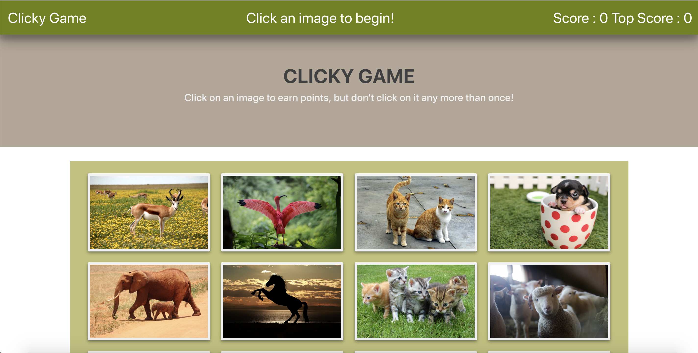

# Clicky-Game

## About the app

* This is a clicking game mainly created using React.

* The game keeps track of the user's score. The user's score is incremented when clicking an image for the first time and resets to 0 if they click the same image more than once.

* Every time an image is clicked, the images rendered to the page shuffle themselves in a random order.

* Once the user's score is reset after an incorrect guess, the game restarts.

## Tools and Technologies

* React
* Javascript
* Bootstrap 4
* CSS 3

## References

* [Pexels.com for animal images](https://www.pexels.com/search/animals/)

